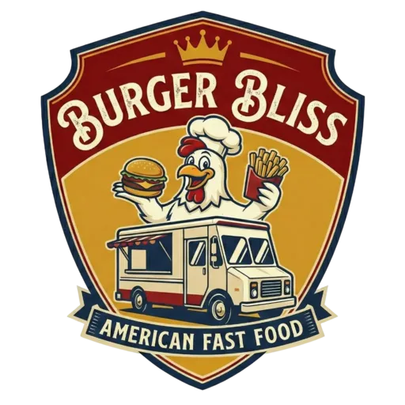

# 🍔 Burger Bliss - Food Truck Gourmet

[](https://github.com/jeanloup33/burger-bliss)
[](https://www.typescriptlang.org/)
[](https://reactjs.org/)
[](https://vitejs.dev/)
[](https://tailwindcss.com/)

Site web premium pour Burger Bliss, un food truck gourmet parisien proposant des burgers artisanaux de qualité. Application web progressive (PWA) avec design moderne, animations fluides et conformité RGPD.

URL de production : https://burgertruck.netlify.app/



## ✨ Fonctionnalités

### 🎨 Design & UX
- **Design Premium** : Interface moderne avec gradients, glassmorphism et micro-animations
- **Responsive** : Optimisé pour mobile, tablette et desktop
- **Animations Fluides** : Framer Motion pour des transitions élégantes
- **Dark Mode Ready** : Palette de couleurs cohérente

### 📱 Progressive Web App (PWA)
- **Installation iOS** : Guide visuel étape par étape pour Safari
- **Installation Android** : Prompt natif avec bouton d'installation
- **Mode Hors Ligne** : Fonctionne sans connexion internet
- **Cache Optimisé** : Images, fonts et assets mis en cache
- **Manifest Complet** : Icons pour iOS, Android et Windows

### 🍪 RGPD & Cookies
- **Banner de Consentement** : Conforme RGPD avec 3 options
- **Paramètres Détaillés** : Gestion granulaire des cookies (nécessaires, analytiques, marketing)
- **Widget Permanent** : Accès rapide aux préférences
- **LocalStorage** : Mémorisation des choix utilisateur

### 🎯 Sections
1. **Hero** : Section d'accueil avec CTA
2. **Histoire** : Présentation du food truck
3. **Menu** : Catalogue de burgers avec filtres
4. **Emplacements** : Carte interactive des lieux
5. **Avis** : Carousel infini de témoignages clients
6. **Contact** : Formulaire avec animations et validation

### 🚀 Performance
- **Build Optimisé** : 440 KB JS (gzip: 137 KB)
- **CSS Minimal** : 39 KB (gzip: 7 KB)
- **Lazy Loading** : Chargement différé des images
- **Code Splitting** : Optimisation automatique par Vite

## 🛠️ Stack Technique

### Core
- **React 18.3** - Bibliothèque UI
- **TypeScript 5.6** - Typage statique
- **Vite 5.4** - Build tool ultra-rapide

### Styling
- **TailwindCSS 3.4** - Utility-first CSS
- **shadcn/ui** - Composants UI réutilisables
- **Framer Motion** - Animations

### PWA & Tools
- **Vite PWA Plugin** - Service Worker & Manifest
- **Workbox** - Stratégies de cache avancées
- **Lucide React** - Icons modernes

## 📦 Installation

### Prérequis
- Node.js 18+ 
- npm ou yarn

### Étapes

```bash
# Cloner le repository
git clone https://github.com/jeanloup33/burger-bliss.git
cd burger-bliss

# Installer les dépendances
npm install

# Lancer le serveur de développement
npm run dev

# Build pour la production
npm run build

# Prévisualiser le build
npm run preview
```

## 🗂️ Structure du Projet

```
burger-bliss/
├── public/                      # Assets statiques
│   ├── logo_BURGER-BLISS-512.webp
│   ├── android/                 # Icons Android
│   ├── ios/                     # Icons iOS
│   ├── windows11/               # Icons Windows
│   └── icons.json               # Manifest icons
├── src/
│   ├── components/              # Composants réutilisables
│   │   ├── layout/
│   │   │   └── Header.tsx       # Header avec navigation
│   │   ├── ui/                  # shadcn/ui components
│   │   │   ├── button.tsx
│   │   │   ├── card.tsx
│   │   │   ├── badge.tsx
│   │   │   ├── input.tsx
│   │   │   ├── label.tsx
│   │   │   ├── textarea.tsx
│   │   │   └── select.tsx
│   │   ├── CookieConsent.tsx    # Système RGPD
│   │   ├── PWAInstallPrompt.tsx # Prompts d'installation
│   │   └── ReloadPrompt.tsx     # Update PWA
│   ├── sections/                # Sections de la page
│   │   ├── HeroSection.tsx
│   │   ├── HistorySection.tsx
│   │   ├── MenuSection.tsx
│   │   ├── LocationsSection.tsx
│   │   ├── ReviewsSection.tsx
│   │   └── ContactSection.tsx
│   ├── lib/
│   │   └── utils.ts             # Utilitaires (cn, etc.)
│   ├── App.tsx                  # Composant principal
│   ├── main.tsx                 # Point d'entrée
│   ├── index.css                # Styles globaux
│   └── vite-env.d.ts            # Types Vite & PWA
├── index.html                   # HTML principal
├── vite.config.ts               # Configuration Vite & PWA
├── tailwind.config.js           # Configuration Tailwind
├── tsconfig.json                # Configuration TypeScript
├── package.json
└── README.md
```

## 🎨 Palette de Couleurs

```css
/* Couleurs principales */
--bliss-orange: #FF6B35    /* Orange principal */
--bliss-brown: #8B4513     /* Brun chocolat */
--bliss-ochre: #D4A574     /* Ocre doré */
--bliss-cream: #FFF8DC     /* Crème */

/* Utilisation dans Tailwind */
bg-bliss-orange
text-bliss-brown
border-bliss-ochre
from-bliss-cream
```

## 🔧 Configuration PWA

Le fichier `vite.config.ts` contient la configuration complète de la PWA :

```typescript
VitePWA({
  registerType: 'autoUpdate',
  manifest: {
    name: 'Burger Bliss - Food Truck Gourmet',
    short_name: 'Burger Bliss',
    theme_color: '#8B4513',
    background_color: '#FFF8DC',
    display: 'standalone',
    // ... icons et autres options
  },
  workbox: {
    // Stratégies de cache pour images, fonts, etc.
    runtimeCaching: [...]
  }
})
```

## 📱 Installation PWA

### iOS (Safari)
1. Ouvrir le site dans Safari
2. Appuyer sur le bouton Partager (en bas)
3. Sélectionner "Sur l'écran d'accueil"
4. Confirmer l'ajout

### Android (Chrome)
1. Ouvrir le site dans Chrome
2. Cliquer sur "Installer" dans le prompt
3. Ou Menu → "Installer l'application"

## 🍪 Gestion des Cookies

Le système RGPD permet de gérer 3 types de cookies :

1. **Nécessaires** (toujours actifs)
   - Session utilisateur
   - Sécurité
   - Préférences de langue

2. **Analytiques** (optionnels)
   - Google Analytics
   - Statistiques de visite

3. **Marketing** (optionnels)
   - Facebook Pixel
   - Google Ads
   - Retargeting

## 🚀 Déploiement

### Netlify / Vercel

```bash
# Build
npm run build

# Le dossier dist/ contient les fichiers à déployer
```

### Configuration recommandée
- **Build command**: `npm run build`
- **Publish directory**: `dist`
- **Node version**: 18+

### Variables d'environnement
Aucune variable d'environnement n'est requise pour le moment.

## 📊 Performance

### Lighthouse Scores (Objectifs)
- **Performance**: 95+
- **Accessibility**: 100
- **Best Practices**: 100
- **SEO**: 100
- **PWA**: ✅

### Optimisations
- ✅ Code splitting automatique
- ✅ Lazy loading des images
- ✅ Compression gzip
- ✅ Cache des assets
- ✅ Minification CSS/JS
- ✅ Tree shaking

## 🤝 Contribution

Les contributions sont les bienvenues ! Pour contribuer :

1. Fork le projet
2. Créer une branche (`git checkout -b feature/AmazingFeature`)
3. Commit les changements (`git commit -m 'Add AmazingFeature'`)
4. Push vers la branche (`git push origin feature/AmazingFeature`)
5. Ouvrir une Pull Request

## 📝 Roadmap

### Version 1.1
- [ ] Intégration Google Maps pour les emplacements
- [ ] Backend pour le formulaire de contact
- [ ] Système de commande en ligne
- [ ] Notifications push

### Version 1.2
- [ ] Programme de fidélité
- [ ] Paiement en ligne
- [ ] Réservation d'événements
- [ ] Multi-langues (EN, ES)

## 📄 Licence

Ce projet est sous licence MIT. Voir le fichier `LICENSE` pour plus de détails.

## 👨‍💻 Auteur

**Burger Bliss Team**
- GitHub: [@jeanloup33](https://github.com/jeanloup33)
- Email: hello@burgerbliss.fr

## 🙏 Remerciements

- [React](https://reactjs.org/)
- [Vite](https://vitejs.dev/)
- [TailwindCSS](https://tailwindcss.com/)
- [shadcn/ui](https://ui.shadcn.com/)
- [Framer Motion](https://www.framer.com/motion/)
- [Lucide Icons](https://lucide.dev/)
- [Unsplash](https://unsplash.com/) pour les images

---

**Made with ❤️ and 🍔 in Paris**
